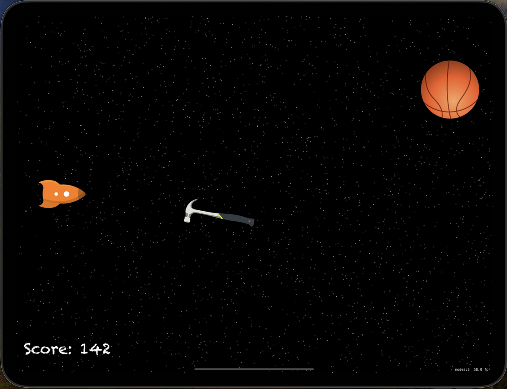
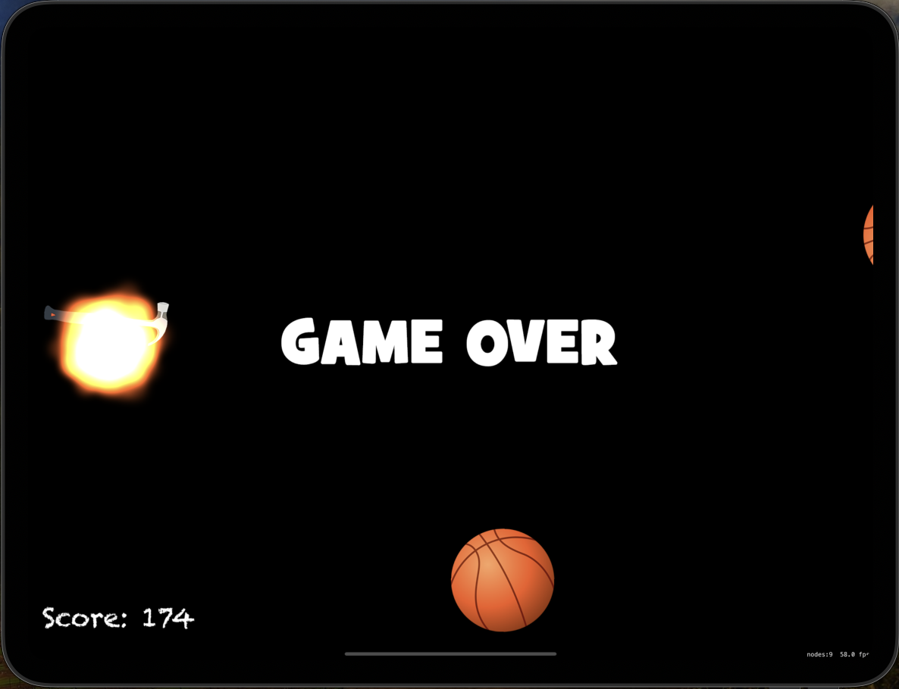

# Project17: Space Race

This is a SpriteKit-based space shooter game where the player controls a spaceship to avoid incoming enemies and score points. The game increases in difficulty as more enemies are created over time.

## Features

* Space-themed game with a starfield background
* Player controls a spaceship to dodge various enemies
* Dynamic difficulty adjustment as the game progresses
* Score tracking with a displayed score label
* Game over screen upon collision with an enemy

## Screenshots

  

  

## Game Rules

* The player controls the spaceship by moving it up and down
* Avoid collision with incoming enemies to keep the game going
* Score points continuously as long as the player survives
* The game ends upon collision with an enemy

## Controls

* Drag to move the spaceship up and down
* Avoid enemies to score points

## Technical Requirements

* iOS 12.0+
* Xcode 12.0+
* Swift 5.0+

## Possible Development

* Add power-ups and special abilities for the player
* Implement different types of enemies with varying behaviors
* Enhance graphics and animations for better visual effects
* Add sound effects and background music
* Introduce a high score tracking system
